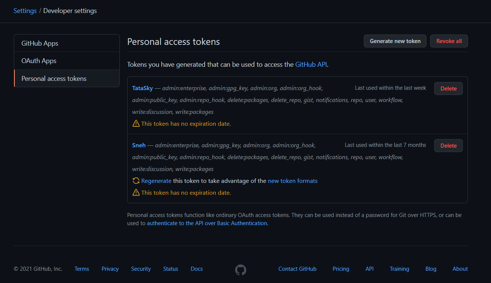
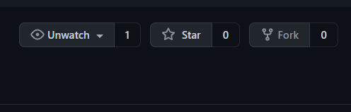
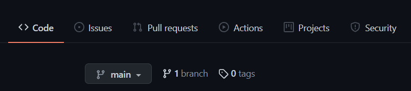
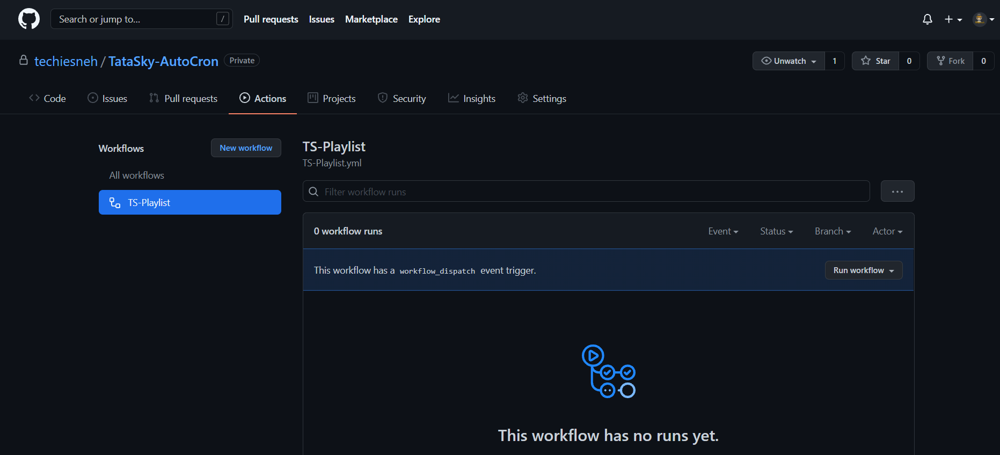
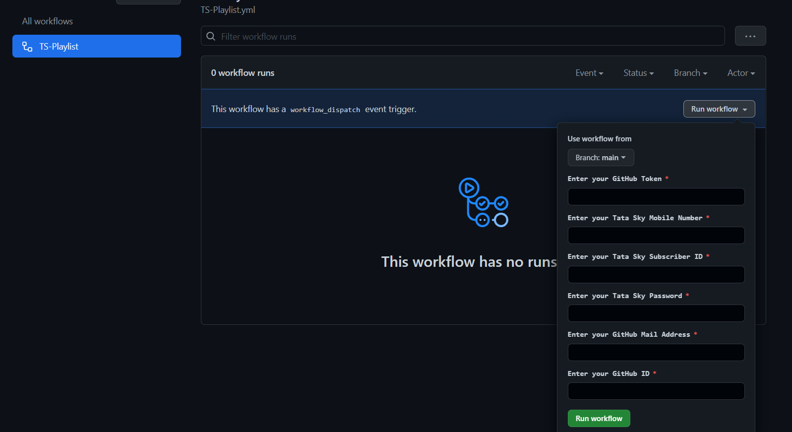
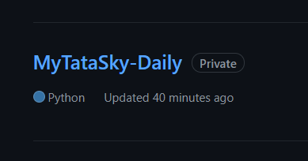
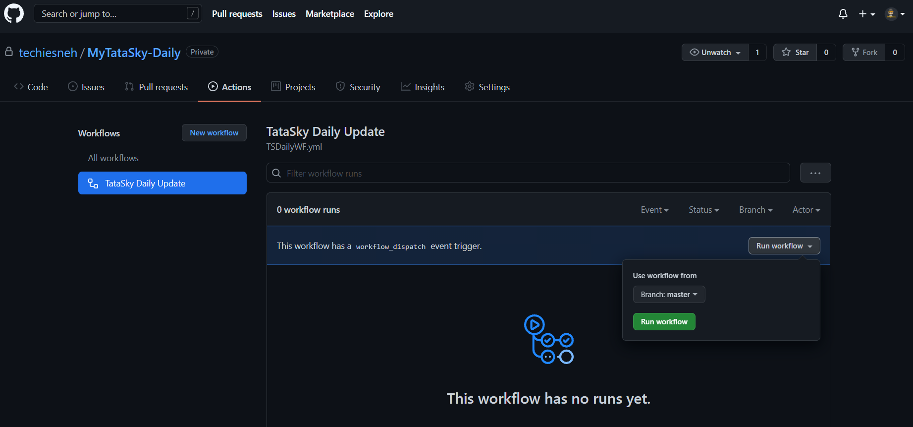

<p align="center"></p>

<h1 align='center'>✯ TataSky Auto Updater✯</h1>

<!-- DO NOT EDIT FILE AND ADD YOU NAME HERE AND PUBLISH -->
<!-- © 2021 TechieSneh -->

<h4 align='center'>📺 The PyBash Script For Auto Update TataSky PlayLists <br>and Play it  on Tivimate 📽 <br>🌟 Star This Repositry Befor Fork 😎<br>😊 Don't Remove Credits<br>Don't Edit This Script 😈<br><br></h4>
<br>

<h2>😇 Features in TataSky :</h2>

- HQ Streaming Free of Cost <br>
- Will Works In 144p, 240p, 360p, 480p, 1080p in this Gives Qualities
- Use OTT Navigator App for quality change option
- TiviMate is preferred app for this playlist

<br>
<h2>🍁 TS Generator Info : </h2>

- This repository is for automatically generating playlist everyday with the same link.
- You don't need to use any app or anything, 
- You just need to do this one-time setup and you're good to go.


<br>
<h2>🐱 Prerequisites : </h2>

* You need to have your own GitHub Token
GithubToken[https://github.com/settings/tokens]
<p align="left"></p>

* Tata Sky account details (Like Subscriber ID, Tata Sky Account Password, Tata Sky Registered Phone number)

* Your GitHub Email and UserID which you're using now


<br>
<h2>🤔 How To Setup : </h2>

### Steps:
1. First of all ```fork``` this repo.
<p align="left"></p>


2. Then go to ```Actions Tab``` in your forked-repo.
<p align="left"></p>


3. Now enter all your details.
4. Click on ```Run Wokflow```
- Step 1
<p align="left"></p>

- Step 2
<p align="left"></p>


5. After clicking on ```Run Workflow```, A new repository will be created in your account named ```"MyTataSky-Daily"```
<p align="left"></p>

6. Go to the new repository named "MyTataSky-Daily"
7. Now under actions click on ```Run Workflow```
<p align="left"></p>


8. Once the workflow has been successful, Check your GitHub gists [__https://gist.github.com__/```your_git_username```] then click on view your Gists. 
- ```For Example : https://gist.github.com/techiesneh```
9. Now you'll see that you'll have ``` mytatasky.m3u ``` there.

10. Open it by clicking on it, Then tap on raw. Copy that link and then modify the link by removing only the the hashcode token after /raw/ in the URL. 
- ```With HashCode: https://gist.githubusercontent.com/techiesneh/080307665ca52d259a6f12cc387c368e/raw/f92b8598766239056e70cafe2ef42b1369f73eae/test.m3u```   
- ```Without HashCode: https://gist.githubusercontent.com/techiesneh/080307665ca52d259a6f12cc387c368e/raw/test.m3u```

11. There you go, Now use that URL in your Tivimate. And Tivimate will update the playlist automatically once you open the app.

12. ``` Most Important ``` Now you don't need to touch anything, It updates the playlist on it's own everyday and you only need to Update the playlist in Tivimate.
All the steps above are to be done only for once.


<br>
<h2>🤡 Explanation on how this works : </h2>

- This works purely on the basis of GitHub Workflow Actions, So a VERY BIG THANKS to GitHub.
- I've created the script where Actions will automatically trigger the workflow everyday for 2:15 AM UTC.
- The tokens, GitHub email and ID are required because we are basically creating another repo and gists with this script using them.

<br>
<h2>📝  Credits : </h2>

1.  ``` ForceGT (Gaurav Thakkar) ``` - For This TataSky Python Repo
2.  ``` Nageshwar128 ``` - For This Bash Script & Adding Login  
3.  ``` WF Owner (GitHub) ``` -  For Their GitHub Actions
3.  ``` Me (techiesneh) ``` - For Just Modifying 😅

<br>

<h2>🚸 Warnings :</h2>

- This is Just For Educational Purpose
- DO NOT Sell this Script, This is 💯% Free

<h3>🤗 Meet Me : </h3>

- For any Help [Techie Sneh](https://t.me/techiesneh)<br>
- Or Contact at [techiesneh@gmail.com](mailto:techiesneh@gmail.com)


---
<h4 align='center'>© 2021 Techie Sneh</h4>
